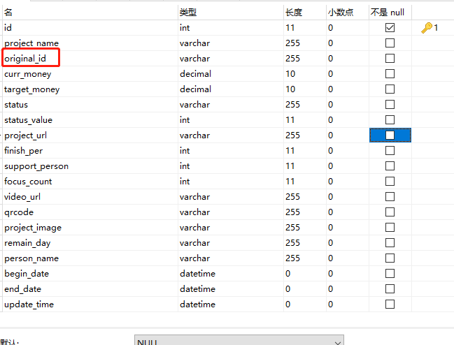
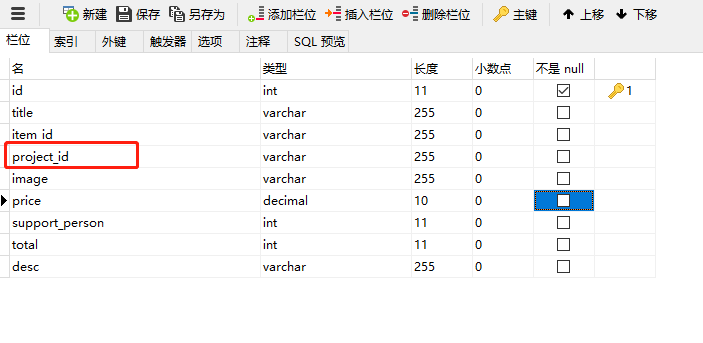
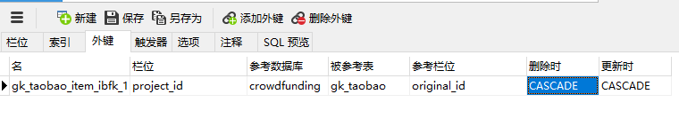

在数据库设置外键，约束条件为CASCAED：
	
	
	
	
	

``` mysql
CREATE TABLE `gk_taobao` (
  `id` int(11) NOT NULL AUTO_INCREMENT,
  `project_name` varchar(255) DEFAULT NULL,
  `original_id` varchar(255) DEFAULT NULL,
  PRIMARY KEY (`id`),
  KEY `original_id` (`original_id`)
) ENGINE=InnoDB AUTO_INCREMENT=2 DEFAULT CHARSET=utf8mb4;
```


``` mysql
CREATE TABLE `gk_taobao_item` (
  `id` int(11) NOT NULL AUTO_INCREMENT,
  `title` varchar(255) DEFAULT NULL COMMENT '标题',
  `item_id` varchar(255) DEFAULT NULL,
  `project_id` varchar(255) DEFAULT NULL,
  PRIMARY KEY (`id`),
  KEY `project_id` (`project_id`),
  CONSTRAINT `gk_taobao_item_ibfk_1` FOREIGN KEY (`project_id`) REFERENCES `gk_taobao` (`original_id`) ON DELETE CASCADE ON UPDATE CASCADE
) ENGINE=InnoDB AUTO_INCREMENT=2 DEFAULT CHARSET=utf8mb4;

```
	
外键gk_taobao_item_ibfk_1中，gk_taobao_item表中的project_id对应gk_taobao表中的original_id，外键约束外级联。
	故：**当project表删除之后，item表中对应的记录会被同时删除**
	